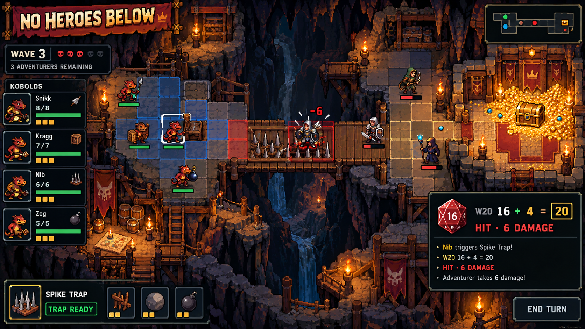
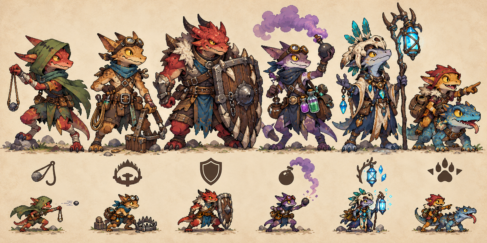
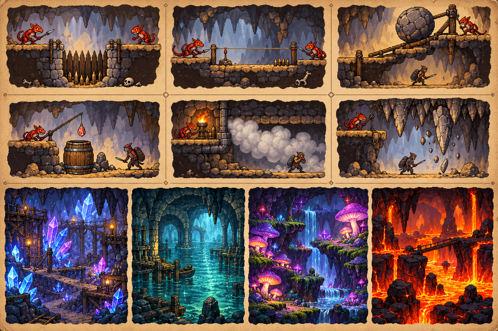

# No Heroes Below
## Full Game Pitch

> **A small kobold crew. A cave full of homemade tricks. An adventuring party that thinks it has seen everything.**

## Elevator Pitch

**No Heroes Below** is a turn-based 2D tactics game in which players defend a vulnerable kobold community against invading adventurers. Kobolds win through scouting, traps, terrain, and well-timed d20 rolls rather than raw strength. Between encounters, players expand the lair; during combat, they command individual kobolds on a grid and resolve attacks against Armor Class and saving throws.

**Genre:** Squad tactics, cave defense, light roguelite progression  
**Mode:** Single-player  
**Perspective:** 2D top-down with a slight isometric feel  
**Target platform:** PC first; controller support after the mouse-and-keyboard prototype  
**Playtime:** 25–40 minutes per run; encounters around 5–10 minutes  
**Audience:** Players who enjoy tactical turns, clever terrain, and humorous fantasy

## Positioning: How *No Heroes Below* Is Different

The closest comparison is the announced game *Kobold Tactics*. Its current Steam description centers on an ambitious kobold who is sent on dangerous missions by a lazy dragon. It lists turn-based tactical combat, recruitable and customizable units, procedurally generated battles across five scenarios, progression between runs, and a playable tabletop version. The Steam page currently lists the game as “Coming soon.” [Public Steam description of *Kobold Tactics*](https://store.steampowered.com/app/3421060/Kobold_Tactics/)

*No Heroes Below* shares some appealing genre elements: kobold characters, turn-based tactics, fantasy, and roguelite progression. The pitch must therefore put its own central fantasy front and center: **The player does not set off on adventures with a kobold squad. They defend their home with a small community as adventurers invade.**

| Design question | *Kobold Tactics*, according to its public description | *No Heroes Below* as a clear design commitment |
|---|---|---|
| **Who is the protagonist?** | An ambitious kobold searching for a new lair and carrying out missions for a dragon. | A community of kobolds; their home is the main setting and the thing the player must protect. |
| **Where does the player go?** | On dangerous missions and into procedurally generated tactical battles. | The attackers come to the lair. The player scouts their route and prepares the defense. |
| **What does preparation mean?** | The description mentions recruiting units, customizing them, and adapting strategies between runs. | Scouting, choosing choke points, placing traps, positioning bait, and keeping escape routes open. |
| **What does the terrain do?** | The public description highlights dynamic, turn-based encounters; it does not detail trap or cave-building systems. | Terrain is the main tactical tool: traps alter routes, lines of sight, cover, and mission objectives. |
| **What does run progression improve?** | Surviving units grow stronger and can be recruited again; the game lists five scenarios. | The community repairs and expands its lair, rescues injured kobolds, and unlocks new defense plans. |
| **How does the d20 work?** | The description mentions tabletop roots and dice, but does not detail the digital d20 resolution. | The pitch promises visible resolution: d20 + modifier against AC, saving throws against traps, and results in a combat log. |

This table compares the pitch with **publicly available information**, not with unreleased or subsequently changed features of *Kobold Tactics*. It does not claim that the other game definitely lacks any particular system. The important point is that *No Heroes Below* should establish its own identity in the first playable moment: adventurers enter the lair, and the player decides how the cave will stop them.

**Development guardrail:** No standalone field missions as the main loop. No campaign that sends the kobold squad on expeditions. Meta progression should serve the community and its defense of the lair. This keeps the distinction tangible in the game itself, rather than only in its description.

## The Promise

Every encounter begins with one question: **How can a few weak kobolds turn their cave into an unfair advantage?** The player sees where adventurers will enter, chooses hiding places and triggers, and sets up a small chain of bait, choke points, and traps. Then they have to improvise: a d20 roll can hit or miss, an adventurer might resist a trap, and an injured kobold may need to be rescued.

The humor comes from situations and kobold personalities rather than constant slapstick. The danger still feels real: kobolds are clever, but fragile.

## Three Design Pillars

1. **Clever beats strong.** Positioning, line of sight, cover, traps, and escape routes matter as much as damage.
2. **Every roll is understandable.** Players see the d20 modifier and enemy AC before rolling; the combat log explains the result afterward.
3. **The lair tells the story of the run.** Rooms and traps are not decoration: they change routes, decisions, and battle plans.

## Core Gameplay Loop

1. **Scout:** Get a rough preview of the next adventuring party: roles, entry direction, strength, and a possible special ability.
2. **Prepare:** Choose kobolds, modify the cave section, place traps, and set starting positions.
3. **Fight:** Move, attack, interact, trigger traps, or fall back in turn-based combat.
4. **Recover:** Treat injured kobolds, gather materials, repair rooms, and secure loot.
5. **Grow:** Choose a new ability, trap, or lair upgrade as the next threat gets tougher.

A run consists of several defenses and a final mission. Defeats cost run resources and may cause injuries, but they do not erase all long-term progress.

## The Kobolds

Each unit is a distinct character with a clear role, a small personality quirk, and individual preferences. Four roles are enough for the prototype; additional units can later add more tactical combinations.

| Kobold | Role | Core ability | Tactical use |
|---|---|---|---|
| **Piks the Scout** | Scouting and luring | **Whistle:** draws a visible enemy toward a marked tile. Stealth can help set up an ambush. | Lures enemies into traps or separates one from the group. |
| **Mumpf the Trapper** | Traps and sabotage | **Quick Rig:** places a simple trap within range; it triggers when an enemy moves over it. | Changes enemy routes and threatens choke points. |
| **Krix the Slinger** | Ranged damage and disruption | **Stone Shot:** d20 attack; on a hit, deals light damage and pushes the target one tile. | Pushes enemies into hazards or out of cover. |
| **Zündel the Shaman** | Support and control | **Smokecap:** blocks sight for one round and grants cover to allied kobolds. | Protects a retreat or opens a flanking route. |
| **Knub the Tunnel Runner** | Melee and rescue | **Drag to Safety:** moves an adjacent injured ally out of a threatened area. | Keeps the crew together and prevents avoidable knockouts. |
| **Bork the Fangleader** | Melee and morale | **Shriek:** nearby kobolds gain a bonus to their next morale check. | Steadies the crew after a loss or a bad roll. |

### Bonds and Personalities

Each unit can have a short trait with a small mechanical effect: timid, curious, greedy, or ambitious. “Curious,” for example, could grant a scouting bonus but tempt a kobold to investigate an unfamiliar chest. Traits should add flavor to planning, not create random punishment.

Injured units recover between encounters if the crew has a safe rest room and enough food. A fallen kobold is first captured or carried out of the fight rather than immediately removed for good; this can create rescue missions.

## Traps, Rooms, and Combos

Traps are less about automatic damage and more about **changing positions**. Some trigger when stepped on; others can be activated manually by a kobold. Each trap shows its range, saving throw, and expected effect.

| Trap | Resolution | Possible combo |
|---|---|---|
| **Pit trap** | Dexterity saving throw; on a failure, damage and restricted movement. | The scout lures an enemy in while the slinger keeps the group back. |
| **Tripwire** | Dexterity saving throw; on a failure, the target falls prone or loses movement. | Place it in a choke point, then block the enemy with rubble. |
| **Rolling boulder** | Dexterity saving throw; damage along a straight path. | Bait or noise draws several enemies into its path. |
| **Smoke vent** | No damage roll; blocks sight and can disrupt attacks or concentration. | The shaman uses the smoke for a safe retreat or flank. |
| **Decoy barrel** | Enemies make a Perception or Investigation check to spot the trick. | An enemy that investigates gives away its position and loses tempo. |
| **Stalactite trigger** | Saving throw against falling rocks; also creates difficult terrain. | The trapper draws enemies into the marked area while melee units move clear. |

### Cave Rooms

- **Workshop:** Repairs one trap after a wave or reduces the cost of a trap.
- **Pantry:** Feeds the kobolds and can become an objective during a raid.
- **Lookout Nook:** Reveals an enemy role or entry route early.
- **Mushroom Garden:** Produces healing mushrooms and smoke materials.
- **Escape Tunnel:** Provides a retreat route, but costs loot or defensive space.
- **Crystal Chamber:** Produces rare materials for one-use trap upgrades.

Rooms occupy fixed cave tiles. They provide benefits but can be damaged. The cave should start as a set of compact, handcrafted sections rather than an endless freeform building system.

## The d20 and Combat Rules

The d20 is visible and central. A normal attack is **d20 + attack bonus against Armor Class**. Ties hit; a natural 20 always hits and doubles the attack’s damage dice, while a natural 1 always misses. Saving throws resist traps and special effects. Stealth and Perception can determine whether an ambush succeeds before combat.

**In-game example:** Krix attacks a fighter with AC 15. Her bonus is +4. The d20 shows 12, for a total of 16: hit. The log shows damage dealt and the target’s remaining hit points. Against a pit trap, the target instead makes a saving throw against the trap’s difficulty.

Before confirming an action, the UI shows:

- Target and Armor Class
- Attack bonus and advantage/disadvantage
- Range and line of sight
- Relevant traps or cover
- Expected outcomes on a hit or miss

After the roll, a short dice animation reveals the number; a persistent log records the result. Rolls come from a central RNG source. Optionally, players can open a replay after a run and review each turn.

## Example Plays: Turning a Plan into a Counter

### Sequence A: Bait and Pit

1. Piks scouts the entrance and spots the cleric as a dangerous support unit.
2. The player places a pit trap at the choke point and marks the cleric as the lure target.
3. Piks whistles and draws the fighter toward the choke point.
4. The fighter makes a saving throw against the pit. On a failure, they fall in and lose movement.
5. Krix attacks the isolated enemy while the cleric’s group has to take the long route.

### Sequence B: Smoke, Flank, Retreat

1. The adventurers spot the traps and move straight toward Zündel.
2. Zündel triggers smoke, blocking lines of sight.
3. Knub pulls an injured kobold out of melee range.
4. The trapper uses the opening to clear the escape tunnel.
5. The player decides whether to grab more loot or retreat with the crew.

### Sequence C: Boulder Run

1. Piks lures two enemies into a straight corridor.
2. Mumpf triggers the rolling boulder; both enemies make saving throws.
3. Survivors are slowed by difficult terrain while the kobolds move to higher ground.
4. The adventurers must regroup as the kobolds secure the pantry.

## Enemies: Adventurers as Readable Roles

Each invading party has a few clear roles. The fighter holds choke points, the cleric heals or protects, the ranger spots traps, and the spellcaster threatens kobolds from range. Enemy groups have visible behavior cues so players can plan around them.

Enemy AI follows understandable priorities: protect injured allies, attack visible high-threat kobolds, inspect suspicious objects, and move toward the mission objective. Enemies can be clever, but they should never use rules the player has not been shown.

## Escalation: From Skirmish to Siege

Difficulty grows along three dimensions: **more enemy options**, **more complex terrain**, and **multiple objectives at once**. Simply inflating hit points is not enough.

| Stage | Example threat | New tactical question |
|---|---|---|
| **1. Waking in the Warren** | 2–3 basic adventurers; open chamber; one trap. | How do I learn movement, d20 attacks, and saving throws? |
| **2. The Scouts** | A ranger checks paths; the party splits up. | Can I use information to isolate enemies? |
| **3. The Mushroom Garden** | Poison or smoke hazards; difficult terrain. | How do I prepare safe and dangerous routes? |
| **4. The Treasure Hunters** | Cleric heals, fighter holds the front, mage controls tiles. | Which unit do I disrupt first? |
| **5. Two Entry Tunnels** | Enemies attack from two directions; kobolds are limited. | Where do I risk a gap, and which room do I deliberately give up? |
| **6. The Siege** | A returning leader, reinforcements, and a pantry under attack. | Do I defend the lair, save supplies, or risk a counterattack? |

Procedural variation can later mix starting positions, obstacles, and wave compositions. Early levels should remain handcrafted so the difficulty curve and tutorial stay reliable.

## Meta-Progression and Runs

Between runs, the kobold community grows rather than simply making every individual unit stronger. Unlocks add roles, traps, and cave modules. During a run, players choose upgrades that open up different tactics.

- **Run rewards:** Materials, food, rescuing a captured kobold, or a new talent.
- **Permanent unlocks:** Additional starting kobolds, trap blueprints, cave modules, and cosmetic variants.
- **No mandatory grind:** New content adds options; it should not be required to beat the basic missions.
- **Run end:** After a successful wave, players can secure their loot or push farther and take on more risk.

## Presentation and Tone

**Art:** High-contrast 2D pixel art or a stylized painterly pixel look. Kobolds have expressive silhouettes and readable tools. Red marks danger tiles; blue and green mark allied actions, with symbols as an additional cue for color accessibility.

**Animation:** Short, clear actions: the die bounces, a trap snaps shut, a unit slips or gets shoved. The UI should never obscure tactical readability.

**Sound:** Cave reverb, creaking wood, mushroom puffs, sling snaps, and a brief musical accent when the d20 lands. Critical hits should feel exciting without dominating every fight.

**Humor:** Short reactions from the kobolds after success or mishaps; combat rules stay clear. No long dialogue between tactical turns.

## Scope for the First Release

**Vertical slice:** 1 cave biome, 1 handcrafted mission, 4 kobold roles, 3 adventurer roles, 3 traps, 1 boss wave, 1 room upgrade, d20 combat UI, and a combat log.

**Small complete game:** 4 biomes, 6 kobold roles, 8 enemy types, 10 traps, 5 mission objectives, around 10–15 runs’ worth of unlockable content, and 2 difficulty modes.

**Save for later:** Multiplayer, huge freeform caves, complex simulation of every kobold need, an endless map editor, and extensive campaign dialogue. The game lives or dies on its tactical core.

## Godot Prototype Architecture

- `CaveGrid` manages tile types, walkability, visibility, and hazards.
- `TacticalUnit` stores movement, AC, hit points, actions, and status effects.
- `TurnDirector` controls preparation, initiative, unit turns, enemy turns, and wave endings.
- `DiceResolver` rolls the d20, checks modifiers, and creates structured combat log entries.
- `TrapDefinition` and `AbilityDefinition` are data resources rather than hard-coded special cases.
- `CombatLog` receives events such as attacks, saving throws, damage, trap triggers, and retreats.
- `EncounterDirector` loads handcrafted waves and later scales them through party composition and terrain.

## Main Risks and Responses

| Risk | Response |
|---|---|
| Too many special rules make turns hard to read. | Keep the action set small; provide clear range previews, short tooltips, and a combat log. |
| Random rolls overpower player planning. | Use modest modifiers, meaningful cover, defensive moves, and limited rerolls; do not erase every failed roll. |
| Traps feel passive. | Add manual triggers, lures, and multiple synergies for each trap. |
| Enemy AI feels unfair or stupid. | Show its priorities, use clear perception rules, and preview enemy intentions. |
| Cave building turns into a second game. | Use prefabricated rooms and a few tactical changes per wave; skip freeform simulation in the first release. |

## Why This Game?

**No Heroes Below** flips the familiar D&D adventure: instead of the heroes clearing the dungeon, its inhabitants respond to the heroes’ incursion. Its identity comes from defending a home, preparing and manually using traps, and keeping a kobold community alive. The d20 makes the SRD connection concrete, the cave gives the genre mix a strategic center, and the vulnerable squad creates tension without huge armies or complex real-time simulation.

### SRD and Licensing Note

The rules can be based on the [SRD 5.2.1](https://www.dndbeyond.com/srd). SRD 5.2 is released under [Creative Commons Attribution 4.0 International](https://media.dndbeyond.com/compendium-images/srd/5.2/SRD_CC_v5.2.pdf). Before release, verify the permitted content and use the official attribution text from the current creator documentation. Protected trademarks, characters, and setting material are not automatically included. *No Heroes Below* is conceived here as an original fantasy game using SRD rules, not an official D&D video game. The included illustrations are visual concepts, not finished Godot assets.
